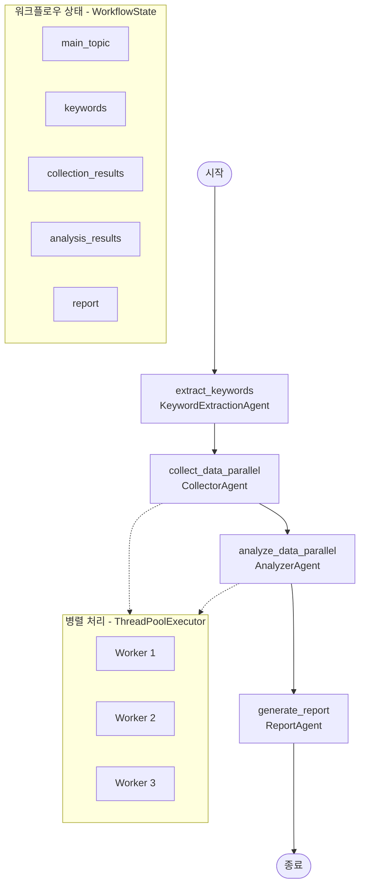

# 미래 기술 트렌드 분석 에이전트 시스템

본 프로젝트는 **미래 기술 트렌드 분석**을 위한 에이전트를 설계하고 구현한 실습 프로젝트입니다.

## Overview

- **Objective** : AI 중심의 최신 기술 동향을 분석하고, 향후 5년 이내 주요 기술 트렌드를 예측하여 보고서 자동 생성
- **Methods** : Agentic Workflow, Prompt Engineering, RAG 기반 문서 요약
- **Tools** : LangGraph, LangChain, OpenAI, arXiv API, Google Trends API

## Features

- 대주제에서 자동 키워드 추출을 통한 분석 대상 설정
- 병렬 처리를 통한 다중 키워드 동시 데이터 수집 및 분석
- LLM 기반 보고서 생성으로 통찰력 있는 내용 제공
- 마크다운 형식의 체계적인 보고서 자동 생성

## Tech Stack

| Category   | Details                      |
|------------|------------------------------|
| Framework  | LangGraph, LangChain, Python |
| LLM        | OpenAI GPT 모델   |
| Data Source  | arXiv API, Google Trends API |

## Agents

### 키워드 추출 에이전트 (KeywordExtractionAgent)

- 역할: 대주제(예: AI)에서 세부 분석 키워드 자동 추출
- 출력: 키워드 목록 및 키워드별 설명

### 데이터 수집 에이전트 (CollectorAgent)

- 역할: 키워드별 논문 데이터 및 Google 트렌드 수집
- 기능:
  - arXiv API를 통한 최신 논문 정보 수집
  - Google Trends API를 통한 관심도 데이터 수집
- 출력: 키워드별 논문 정보 및 트렌드 데이터

### 분석 에이전트 (AnalyzerAgent)

- 역할: 수집된 데이터를 기반으로 기술 트렌드 분석
- 기능:
  - 논문 수, 발행 패턴, 인용 정보 분석
  - 트렌드 요약, 영향력 평가, 활용 가능 산업 분석
  - 잠재적 위험 요소 및 사업 기회 도출
- 출력: 키워드별 상세 분석 결과

### 보고서 생성 에이전트 (ReportAgent)

- 역할: 분석 결과를 바탕으로 마크다운 형식의 보고서 생성
- 기능:
  - LLM 기반 통찰력 있는 트렌드 분석 내용 생성
  - 키워드별 세부 섹션 자동 구성
  - 종합 결론 및 미래 전망 제시
- 출력: 구조화된 마크다운 보고서

## State

| Key                  | Description                                |
|----------------------|--------------------------------------------|
| `main_topic`         | 분석할 대주제 (사용자 입력)                |
| `keywords`           | 대주제에서 추출된 세부 키워드 목록         |
| `status`             | 워크플로우 실행 상태 (started/completed/failed) |
| `collection_results` | 키워드별 데이터 수집 결과 정보             |
| `analysis_results`   | 키워드별 분석 결과 정보                    |
| `report`             | 생성된 보고서 내용 (마크다운 형식)         |
| `report_path`        | 저장된 보고서 파일 경로                    |
| `failed_keywords`    | 처리에 실패한 키워드 목록                  |
| `errors`             | 워크플로우 처리 중 발생한 오류 목록        |

## Architecture



## Directory Structure

```bash
project-root/
├── agents/                       # 에이전트 모듈
│   ├── keyword_extraction_agent.py # 키워드 추출 에이전트
│   ├── collector_agent.py        # 데이터 수집 에이전트
│   ├── analyzer_agent.py         # 데이터 분석 에이전트
│   └── report_agent.py           # 보고서 생성 에이전트
├── utils/                        # 유틸리티 모듈
│   └── logger.py                 # 로깅 유틸리티
├── outputs/                      # output 저장
├── logs/                         # 워크플로우 로그
├── workflow.py                   # 전체 워크플로우 관리
├── main.py                       # 메인 실행 파일
└── README.md                     
```

## env

```bash
touch .env
```

```bash
# .env
OPENAI_API_KEY=your_openai_api_key
NEWS_API_KEY=your_news_api_key
```

## Usage

```bash
# 가상환경 설정
python -m venv venv
source venv/bin/activate

# 패키지 설치
pip install -r requirements.txt

# 실행
python main.py --keyword "{원하는 키워드}" -f pdf
```

## Contributors

- 고석환: Prompt Engineering, Agent Design, 트렌드 예측 로직 설계
